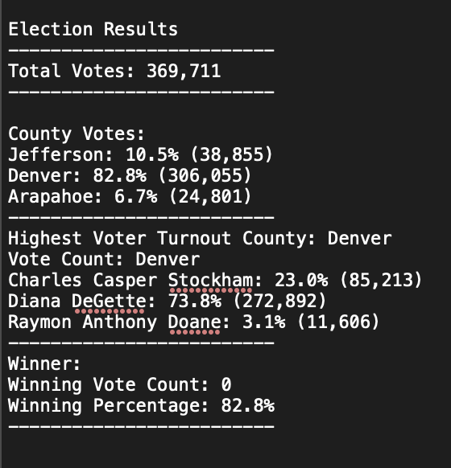

# Overview of the Election Audit:
***Here we are running the project to audit the results of an election to find out the following :***
1. The voter turnout for each county.
2. The percentage of votes from each county out of the total count.
3. The county with the highest turnout.

*To compare the results and determine the highest reciever of the votes.*

# Election-Audit Results: 
#### We will present the images and lists of conclusions we were able to derive from the project and how these results were calculated -

- ***How many votes were cast in this congressional election?***
  - *Total votes cast is 369,711.*

- ***Provides a breakdown of the number of votes and the percentage of total votes for each county in the precinct:***
  - *Jefferson: 10.5% (38,855)*
  - *Denver: 82.8% (306,055)*
  - *Arapahoe: 6.7% (24,801)*

- ***County had the largest number of votes:***
  - *Denver.*

- ***Provides a breakdown of the number of votes and the percentage of the total votes each candidate received***:
  - *Charles Casper Stockham: 23.0% (24,801).*
  - *Diana DeGette: 73.8% (24,801).*
  - *Raymon Anthony Doane: 3.1% (24,801)*

- ***The candidate  who won the election was :***
  - *Diana Degette with 272,857 votes total meaning a total vote share of 73.8%*

# Election-Audit Summary:

From this analysis we can derive that -
- Political campaigning in Denver is the most valuable region.
- Also tells us to host events for our candidates in Denver over the other counties.
- We could also use the same script to include other polling data such as gender, age, political affiliation and race.

